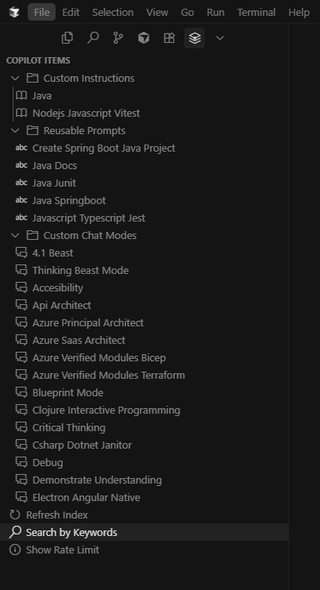

# Awesome Copilot Toolkit

A VS Code extension that lets you browse and install items from the [github/awesome-copilot](https://github.com/github/awesome-copilot) repository. Discover and install Custom Instructions, Reusable Prompts, and Custom Chat Modes directly within VS Code.

## Table of Contents

- [Features](#features)
- [Content Types](#content-types)
- [Commands](#commands)
- [Installation](#installation)
- [Access Methods](#access-methods)
- [Configuration](#configuration)
- [Usage](#usage)
- [Screenshots](#screenshots)
- [Development](#development)
- [Contributing](#contributing)
- [License](#license)
- [Changelog](#changelog)
- [Rate Limiting](#rate-limiting)
- [Support](#support)
- [Privacy](#privacy)

## Features

- **Multiple Access Methods**: Status bar, sidebar panel, command palette, and context menus
- **Browse All Items**: Search through all available copilot resources
- **Filter by Type**: Browse specific categories (Instructions, Prompts, Chat Modes)
- **Keyword Search**: Search by keywords with intelligent suggestions
- **Rich Preview**: View markdown and JSON content with syntax highlighting
- **One-Click Install**: Install items to your workspace or open as untitled documents
- **Smart Caching**: Efficient caching with configurable TTL
- **Deep Link Support**: Automatic deep linking for chat instructions when available
- **Real-time Rate Limit Monitoring**: Always visible API status in status bar

## Content Types

### Custom Instructions
- Browse and install custom instruction files (`.instructions.md`)
- Automatic deep linking to VS Code's chat instructions system
- Preview with markdown rendering

### Reusable Prompts
- Discover reusable prompt templates (`.prompt.md`)
- Preview and copy prompts for use in your projects
- Install to workspace for easy access

### Custom Chat Modes
- Explore custom chat mode configurations (`.chatmode.md`)
- Markdown preview with syntax highlighting
- Install to workspace for project-specific chat modes

## Commands

### **Quick Access (Recommended)**
- **Status Bar**: Click the "Awesome Copilot" item in the status bar
- **Sidebar**: Use the dedicated sidebar panel for browsing and actions

### **Command Palette Commands**
Access these commands via the Command Palette (`Ctrl+Shift+P` / `Cmd+Shift+P`):

- `Awesome Copilot: Browse All` - Browse all available items
- `Awesome Copilot: Browse Custom Instructions` - Browse only custom instructions
- `Awesome Copilot: Browse Reusable Prompts` - Browse only reusable prompts
- `Awesome Copilot: Browse Custom Chat Modes` - Browse only custom chat modes
- `Awesome Copilot: Search by Keywords` - Search items by keywords
- `Awesome Copilot: Refresh Index` - Force refresh the item index
- `Awesome Copilot: Clear Cache` - Clear the cached index
- `Awesome Copilot: Show Rate Limit` - Check GitHub API rate limit status

## Installation

1. Install the extension from the VS Code marketplace
2. The extension will automatically appear in your status bar and sidebar
3. Click the status bar item or use the sidebar to access features
4. The extension will build an index of available items
5. Browse, preview, and install items as needed

## Access Methods

### 🎯 **Status Bar (Recommended)**
- **Always Visible**: Click the "Awesome Copilot" status bar item for quick access
- **Quick Actions**: Dropdown menu with all main features
- **Rate Limit Status**: Real-time GitHub API status indicator
- **One-Click Access**: No need to remember commands

### 📁 **Sidebar Panel**
- **Dedicated View**: Custom sidebar with hierarchical item view
- **Category Browsing**: Expand categories to see all items
- **Quick Actions**: Right-click items for preview, install, or browse
- **Visual Organization**: Clear separation of content types

### ⌨️ **Command Palette**
- **Traditional Access**: Use `Ctrl+Shift+P` / `Cmd+Shift+P`
- **All Commands**: Complete list of available actions
- **Keyboard Navigation**: Fast access for power users

### 🖱️ **Context Menus**
- **Right-Click Integration**: Access from file explorer
- **Workspace Actions**: Quick install and search options
- **Contextual Access**: Actions available where you need them

## Configuration

The extension provides several configuration options:

- `awesomeCopilotToolkit.defaultInstallLocation`: Choose where to install items (`workspace`, `untitled`, or `both`)
- `awesomeCopilotToolkit.cacheTtlHours`: Set cache TTL in hours (default: 24)
- `awesomeCopilotToolkit.useDeepLinksWhenAvailable`: Enable deep linking for chat instructions (default: true)

## Usage

### **Quick Start (Recommended)**

1. **Click the status bar**: Look for "Awesome Copilot" in your status bar
2. **Choose an action**: Select from the dropdown menu
3. **Browse and install**: Use the intuitive interface to find items

### **Using the Sidebar**

1. **Open the sidebar**: Click the "Awesome Copilot" icon in the activity bar
2. **Browse categories**: Expand folders to see items by type
3. **Quick actions**: Right-click items for preview, install, or browse options

### Browsing Items

1. **Status Bar**: Click the status bar item and select "Browse All Items"
2. **Sidebar**: Use the sidebar panel for visual browsing
3. **Command Palette**: Use `Ctrl+Shift+P` and run browse commands
4. Use the search box to filter items
5. Select an item to see available actions

### Searching by Keywords

1. **Status Bar**: Click the status bar item and select "Search by Keywords"
2. **Sidebar**: Use the "Search by Keywords" action in the sidebar
3. **Command Palette**: Use `Ctrl+Shift+P` and run "Awesome Copilot: Search by Keywords"
4. Enter one or more keywords (e.g., "azure", "dotnet", "testing")
5. Get intelligent suggestions for popular search terms
6. View search results and take actions on matching items

### Previewing Content

- **Markdown Files**: Rich preview with syntax highlighting and action buttons
- **JSON Files**: Formatted JSON with copy and view options
- **Actions Available**: Copy content, open raw, view on GitHub

### Installing Items

1. Select an item from the browse view
2. Choose "Install" from the action menu
3. Select installation location (workspace, untitled, or both)
4. Items are installed to `.vscode/copilot-*` folders in your workspace

### Workspace Installation

Items are installed to:
- `.github/copilot-instructions/` - Custom instructions
- `.github/copilot-prompts/` - Reusable prompts  
- `.github/copilot-chatmodes/` - Custom chat modes

## Screenshots

### Sidebar Explorer

### Status Bar Menu

### Quick Actions Menu

### Rate Limit Indicator

## Development

### Prerequisites

- Node.js 18+
- VS Code 1.85+

### Setup

1. Clone the repository
2. Run `npm install`
3. Run `npm run build`
4. Press F5 to launch the extension in a new VS Code window

### Build Commands

- `npm run build` - Build the extension
- `npm run watch` - Watch mode for development
- `npm run test` - Run tests
- `npm run package` - Package the extension

## Contributing

Contributions are welcome! Please feel free to submit issues and pull requests.

## License

This extension is licensed under the MIT License.

## Changelog

See [CHANGELOG.md](CHANGELOG.md) for a list of changes and updates.

## Rate Limiting

The extension automatically handles GitHub API rate limiting:

- **Real-time Monitoring**: Always visible rate limit status in the status bar
- **Automatic Delays**: Built-in delays between requests to avoid hitting limits
- **Rate Limit Monitoring**: Checks rate limit status before making requests
- **Smart Waiting**: Automatically waits for rate limit reset when needed
- **User Notifications**: Shows warnings when rate limits are low
- **Rate Limit Info**: Click the rate limit indicator in status bar or use "Show Rate Limit" command

### Rate Limit Access

- **Status Bar Indicator**: Always visible GitHub API status
- **Click to Check**: Click the rate limit indicator for detailed information
- **Automatic Warnings**: Visual alerts when limits are low
- **Smart Recovery**: Extension automatically waits for reset when needed

## Support

If you encounter any issues or have questions:

1. **Check Status Bar**: Look at the rate limit indicator for API status
2. **Use Sidebar**: Browse items and check for errors in the sidebar
3. **Check Output**: Use "Awesome Copilot: Show Rate Limit" to check API status
4. **Review Issues**: Check the [GitHub issues](https://github.com/your-repo/issues)
5. **Network**: Ensure you have a stable internet connection for GitHub API access

### **Quick Troubleshooting**

- **No items showing**: Click the status bar item and select "Refresh Index"
- **Rate limit issues**: Check the rate limit indicator in the status bar
- **Installation problems**: Use the sidebar to browse and install items
- **Search not working**: Try the "Search by Keywords" option from status bar

## Privacy

This extension:
- Respects VS Code's telemetry settings
- Only makes requests to GitHub's public API
- Caches data locally with configurable TTL
- Does not collect or transmit personal information
